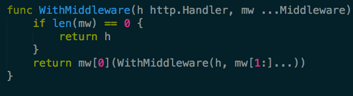
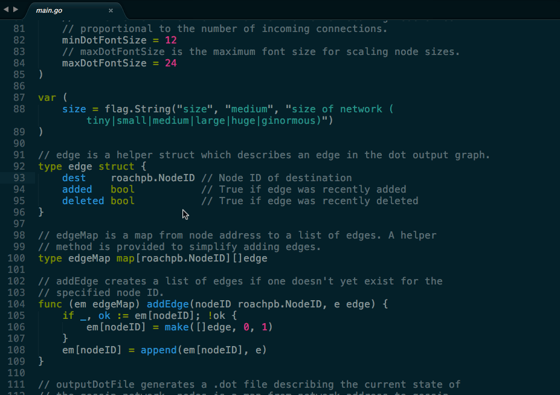
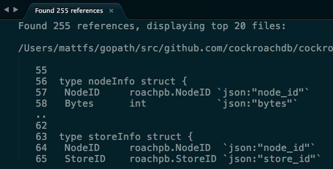
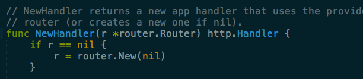
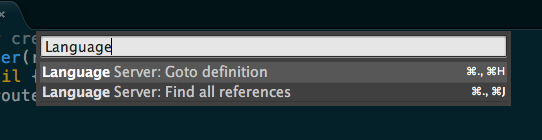

# LSP Connector for Sublime Text

A [Language Server Protocol](https://github.com/Microsoft/language-server-protocol) connector for Sublime Text 3.

*The project is in beta mode. Feedback or issue? Please email us at support@sourcegraph.com or [file an issue.](https://github.com/sourcegraph/sublime-lsp/issues)*

## Overview

The [Language Server Protocol](https://github.com/Microsoft/language-server-protocol) is a specification that enables advanced language capabilities in an editor independent-way. Previously, to support a given language in a given editor, an editor extension writer would have to _both_ write the editor specific functionality _as well as_ language analysis capabilities for each language. This means that every editor and language had different levels of capability and reliability.

With LSP, one editor extension can be written per editor, and one language server per language. [Sourcegraph's master plan](https://sourcegraph.com/plan) is to support editor and language server open source authors, [let us know](mailto:hi@sourcegraph.com) if you'd like to work on one!

This plugin borrows heavily from the popular [Microsoft TypeScript Sublime Plugin](https://github.com/Microsoft/TypeScript-Sublime-Plugin).

## Operations supported

This connector currently supports:
* [hover](https://github.com/sourcegraph/sublime-lsp#hover) operations (Sublime build >=3124)
* [goto definition](https://github.com/sourcegraph/sublime-lsp#go-to-definition)
* [find all references](https://github.com/sourcegraph/sublime-lsp#find-all-references)
* [error highlighting](https://github.com/sourcegraph/sublime-lsp#diagnostics)

Autocomplete, semantic symbol-based search, formatting utilities will soon be supported.

## Languages supported

This plugin has been developed for use with the [go-langserver](https://github.com/sourcegraph/go-langserver) language server. [Sourcegraph](https://sourcegraph.com) is currently developing JavaScript/TypeScript, Python, and PHP language servers, which will also work with this adapter. Finally, any language server implementing the [Language Server Protocol](https://langserver.org) can be connected to this plugin.

## Installation

### Connector installation

Install the `sublime-lsp` connector for Sublime Text by cloning `sublime-lsp` repository into your Sublime Text 3 Packages folder:

macOS:

```shell
git clone git@github.com:sourcegraph/sublime-lsp.git ~/Library/Application\ Support/Sublime\ Text\ 3/Packages/sublime-lsp
```

Linux:

```shell
git clone git@github.com:sourcegraph/sublime-lsp.git ~/.config/sublime-text-3/Packages/sublime-lsp
```

Windows:

```bat
cd "%APPDATA%\Sublime Text 3\Packages"
git clone https://github.com/sourcegraph/sublime-lsp
```

### Go installation

Install the `langserver-go` binary by running `go get -u github.com/sourcegraph/go-langserver/langserver/cmd/langserver-go`. The `langserver-go` binary should now be available via your command line.

Next, configure the LSP connector for the `langserver-go` binary. To change your Sourcegraph settings, open `SublimeLsp.sublime-settings` by clicking `Sublime Text > Preferences > Package Settings > Sublime Lsp Connector > Settings - User`.

Add the following client descriptor into `clients` section

```
{
    ...
        "clients": [
            {
                "binary": "langserver-go",
                "file_exts": ["go"],
                // the go binary must be in the path
                "path_additions": ["/usr/local/go/bin"],
                "env": {
                    // GOPATH is a required argument, ~'s don't work
                    "GOPATH": "",
                }
            }
        ]
    ....
}
```

Finally, restart Sublime Text to start using the plugin. You may want to [disable Sublime's native tooltips](https://github.com/sourcegraph/lsp-sublime#remove-sublime-text-3-tooltips-and-goto-menu-items), as they are duplicative and interfere with this connector's tooltips.  

### TypeScript/JavaScript installation

First, you need to add TypeScript Sublime support the following way:

```shell
git clone git clone https://github.com/Microsoft/TypeScript-TmLanguage ~/Library/Application\ Support/Sublime\ Text\ 3/Packages/TypeScript-TmLanguage
```

Linux:

```shell
git clone https://github.com/Microsoft/TypeScript-TmLanguage ~/.config/sublime-text-3/Packages/TypeScript-TmLanguage
```

Windows:

```bat
cd "%APPDATA%\Sublime Text 3\Packages"
git clone https://github.com/Microsoft/TypeScript-TmLanguage
```

Then install the TypeScript/JavaScript LSP server the following way:

```shell
export JSTS_DIR=...
git clone https://github.com/sourcegraph/javascript-typescript-langserver $JSTS_DIR
cd $JSTS_DIR
npm install
node_modules/.bin/tsc
```

Please make sure that `$JSTS_DIR/bin` is in `$PATH`

Next, register TypeScript/JavaScript LSP client. To change your Sourcegraph settings, open `SublimeLsp.sublime-settings` by clicking `Sublime Text > Preferences > Package Settings > Sublime Lsp Connector > Settings - User`.

Add the following client descriptor into `clients` section

```
{
    ...
        "clients": [
            {
                "binary": "javascript-typescript-stdio",
                "file_exts": ["ts", "tsx", "js", "jsx"]
            }
    ]
    ...
}
```

Finally, restart Sublime Text to start using the plugin. You may want to [disable Sublime's native tooltips](https://github.com/sourcegraph/sublime-lsp#remove-sublime-text-3-tooltips-and-goto-menu-items), as they are duplicative and interfere with this connector's tooltips.  


## Usage

### Hover

As you navigate through Go files, when your cursor is on a symbol, you should see hover tooltips. You may have to [disable Sublime's native tooltips](https://github.com/sourcegraph/sublime-lsp#remove-sublime-text-3-tooltips-and-goto-menu-items).



### Goto definition

[Execute](https://github.com/sourcegraph/sublime-lsp#open-the-command-window) the `Lsp: Goto definition` command, and Sublime will jump to the definition of a symbol in your workspace.



### Find all references

[Execute](https://github.com/sourcegraph/sublime-lsp#open-the-command-window) the `Lsp: Find all references` command, and Sublime will open up a results pane with semantic references to the symbols within your project.



### Diagnostics

As you type, the language server connector will receive diagnostics from the language server. If any errors are detected, the editor will display a tooltip when the offending text is clicked.



## Troubleshooting

### Make sure the langserver-go is installed
Run `langserver-go -h` in your command line. You should see a help menu.

### Sublime Text 3 version check
For hover tooltips to work, you'll need Sublime Text 3, Build 3124 (released in 9/2016). Navigate to `Sublime Text > About Sublime Text` to check the version.

### Remove Sublime Text 3 tooltips and Goto menu items
If you are seeing two tooltips that flicker when you hover over symbols, you may have to disable Sublime Text 3 tooltips. Navigate to `Sublime Text > Preferences > Settings`, and add the following lines:

```
{
    ...
    "show_definitions": false, // recommended: removes default Sublime tooltips
    "index_files": false, // optional: removes default Sublime "Goto Definition" from right click
    ...
} 
```

## Using Sublime with LSP Connector

### Open the command window

To open Sublime's command window and access LSP connector operations, just execute the following key combination:
* Linux/Windows <kbd>ctrl</kbd>+<kbd>shift</kbd>+<kbd>p</kbd>
* Mac <kbd>command</kbd>+<kbd>shift</kbd>+<kbd>p</kbd>

Any search items starting with `Language Server` is provided by the LSP connector.



### Add right click menu options

By default, the sublime-lsp connector includes two options to your right click menu. `Find local references` and `Explore code at cursor.`

### Change default keybindings

TBD

## Support

Found a bug, want to request a feature, or want to help Sourcegraph build the global graph of code? Send us an email at hi@sourcegraph.com.
